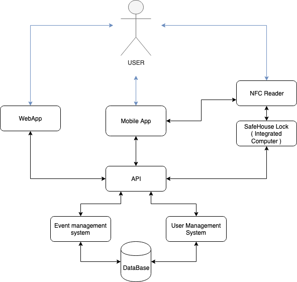
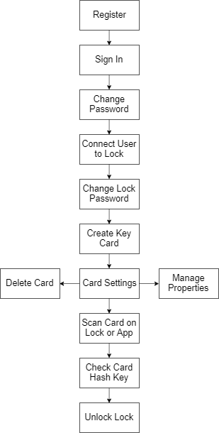
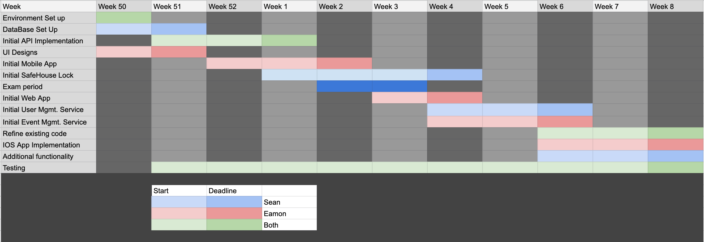

# **SafeHouse**

## **CA326 Functional Specification**

**Eamon Crawford and Sean Hammond**

## **Table of Contents**

### **1. Introduction**

1.1 Overview

1.2 Business Context

1.3 Glossary

### **2. General Description**

2.1 Product / System Functions

2.2 User Characteristics and Objectives

2.3 Operational Scenarios

2.4 Constraints

### **3. Functional Requirements**

3.1 Register

3.2 Sign In

3.3 Change User Password

3.4 Connect User to Lock

3.5 Create New Key Card

3.6 Scan Card on App

3.7 Scan Key on Door

3.8 Manage/Delete Keys

3.9 Change Lock Password

3.10 View Lock Analytics

### **4. System Architecture**

4.1 System Architecture Diagram

4.2 System Architecture Diagram Description

### **5. High-Level Design**

5.1 High Level Design Diagram

5.2 High Level Design Description

### **6. Preliminary Schedule**

### **7. Appendices**

## **Introduction**

**1.1 Overview**

The goal of development is to create a locking system for doors that can be interfaced with through the use of an app. It will allow users to use the NFC functionality of Android mobile devices to write keys to NFC cards. The app can then scan these cards, and open the assigned lock. The lock itself can also scan NFC cards and will unlock if the card holds the correct key. Cards can be managed by the user who created them, however any user can scan the card on their phone to unlock the door. Cards can have a limited number of uses, expire after a certain amount of time, and can be deleted.

The system is being developed to accommodate for easy management of access to specific buildings, apartments or doors. For example, this system would be useful for people who own an AirBnB and want to ensure that the visitor’s keys cannot be used to gain access to the building after their stay has ended. Offices could also make use of this system, easily allowing for the creation of visitor’s passes as well as permanent employee cards.

**1.2 Business Context**

The primary business context for this product is the sale of the lock system that must be installed onto the desired door, and the appropriate NFC cards. While any NFC cards of the appropriate type would work, the product would be sold with cards together for convenience to the customer.

Alternatively, the product’s concept could be sold to an external organisation as intellectual property, who could then mass produce and sell the product on a much larger scale than otherwise possible.

**1.3 Glossary of Terms**

*   **NFC:**

    **N**ear **F**ield **C**ommunication. Short-range wireless technology that enables simple and secure communication between two devices.

*   **MySQL:**

    An open source relational database management system (RDBMS) based on Structured Query Language(SQL).

*   **React Native:**

    React Native is a JavaScript framework for writing real, natively rendering mobile applications for iOS and Android.

*   **Raspberry Pi:**
   	A low cost, extremely small PC that is capable of running a Linux OS.

## **2. General Description**

**2.1 Product / System Functions**

_Unlocking functionality_

The most important functionality for our systems is being able to use the Android application as a Key for locks on the system. Users will be able to open and lock doors on the network through the app in a number of ways, depending on the user set configuration for a given lock. The first method we will discuss is using the phone’s NFC functionality on the lock’s NFC reader. A user can select to open a lock locally on the app which will inform them to bring the phone to the lock’s reader. The app will contain a unique hash key for the lock which will be recognised by the lock system allowing it to unlock. This will be wrapped in a common form of encryption. We can also unlock the door using preset NFC cards that will contain a unique hash key. The app will be able to write to these NFC cards, for this purpose. If the lock is connected to a local wifi network, users will also be able to open it remotely using the android application.

_Set Up Locks_

Locks will have to be configured using the app when first set up. Users will be able to specify whether or not the lock should require a password to unlock, rather than using preset hashed keys. This will allow users to unlock the system in the event of losing access to their account, by downloading the app, scanning for the lock and inputting the lock’s password when prompted. Locks will also be able to be configured to allow, or not allow remote opening, nfc card openings and having set times when they should be unlocked or locked.

_Create and manage NFC Cards_

If the user is say, running a few AirBnB apartments, they could acquire a few NFC cards for their guests and write the keys needed to these cards, using just their phone and  the SafeHouse android app. They will be able to set expiration dates on the system for such cards so if they are lost or stolen by guests there is no security issue. If a guest also reports a card stolen the user will be able to deactivate that key earlier.

_Reporting_

Users will be able see visualized data drawn from usage of the system as well as real time data where available. When specific doors were unlocked and by what key. This will provide a security benefit to the owner, as well as allow informed decision making. For example if you know most guests in your bnb leave around 11am each day, you can organise that the room doesn’t get serviced until then. The real time data allows users to see what SafeHouse locks are currently locked or opened.

_Web app_

There will be a web app that will allow limited functionality from the android application. This is due to not having access to the mobile device’s NFC chip. However even with limited functionality the user will be able to use the web app to see visualied reported data, control locks that allow remote control, and manage the configuration of locks on the system.

_Sharing Keys _

Users will be able to share keys between their accounts as an easy way to give access to friends and family. Furthermore, users will be able to request one time access by scanning the lock with their app and hitting “request from owner”.

_Storing User Data_

Users will have to create an account with us, so in the event that their phone is lost or stolen they can log in and restore their data

**2.2 User Characteristics and Objectives**

The target audience is small to mid level bnb owners as well as general homeowners. We do not expect the users to have a high expertise in computer systems and will build around this. The User Interface must be simple and intuitive, our target user doesn't want to spend much time learning it. Ideally the system saves time and energy for the user, making it a valuable tool, and does so with little effort and maintenance from the user. After set up there shouldn’t be much work for the user to continue using the system

In the situation where a user has a friend or customer who needs to interact with one of the locks, the friend will need to download the app too. This temporary users has separate needs to a more full time manager user. One of these needs is for the app to be lightweight for this temporary usage. A user should not have to remove other apps to make space for this temporary userage. The download should be small and fast.

**2.3 Operational Scenarios**

_Set up_

After physical installation of a lock, the small integrated computer and NFC reader ( We Will Call This System SafeHouse lock), the user will have to add their SafeHouse lock to their account be scanning it with the app / finding it on the wifi network. Once the SafeHouse lock is attached to the users account, they will be prompted to configure their new lock. Clicking the prompt or navigating to the lock manage page will allow the users to set the configuration of the lock. Configuration will include options for allowing the lock to be opened remotely, setting whether the SafeHouse lock should lock automatically after the door is closed or if it needs to be locked by a user with a key, allowing NFC signals from source other that the app to be read (allowing NFC card keys to be made and used), and setting times for the lock to be locked or opened on a schedule. To end configuration the user will be asked to present their phone to the scanner, and if the SafeHouse lock interrupts the nfc signal from the phone successfully, set up will be complete. Otherwise the user will be prompted to try again and troubleshoot and SafeHouse lock will not lock the door until this has been resolved. With set up complete the user will be prompted to go to the home page in the SafeHouse app where they can now see the status of their newly added SafeHouse lock. 

_Basic usage_

User approaches door with SafeHouse lock that is currently lock. User takes out phone and opens SafeHouse app with a logged in profile. User holds phone up to SafeHouse lock’s scanner. App recognize scanner and response with key signal. SafeHouse lock beeps and unlocks door.

User approaches door with SafeHouse lock that is currently lock. User takes out Nfc key card. Key Card was previously written to by app, with a key for this SafeHouse lock.  User holds card up to SafeHouse lock’s scanner. Card gets activated by scanner and response with key signal. SafeHouse lock beeps and unlocks door.

User has a job scheduled for something in their home but will be out when the worker is set to arrive. User waits for a phone call from worker and opens the door remotely by logging in on the web app and pressing open by the SafeHouse lock for their front door. User is asked to confirm and they click yes. The safeHouse lock receives the signal as its connected to the internet via the home wifi and opens the door.

_Managing keys_

User has 2 small apartments for rent to tourists. User has installed SafeHouse locks for both of these apartments. They create NFC keys to be given to the guest using the SafeHouse app. They navigate to the key management page for the SafeHouse lock. They select ‘create nfc key’, and the phone prompts them to hold a rewritable NFC keycard up to the phone. When one is presented, the app writes a unique key to that card’s NFC tag. This unique key is also registered on the SafeHouse Lock. The user can then give these cards out to their guests.  \
In the case where a guest fails to return a key, the key can be disabled from the manage keys menu in the app. To also avoid this issue, when creating the key, the user can set a period of time when it is valid.

_Reports_

Users can see when each key has been used and who that key belongs to. This could be used in the event of a theft at a company building with multiple non trusting employees, as each key is unique to one person.

_Sharing keys_

For multi-location businesses, employees may need access to multi sites. To stop the need for giving these employees multiple keys, a user can just share the needed keys to that employee through the app. The user can create a new keys and share their secret keys with the employee, who can import them into the app. Now the employee has all their needed access on one device.

**2.4 Constraints**

_Hardware costs_

We are limited by the hardware we can afford. While it would be nice to have many mobile devices to test the app on and more than a few Raspberry Pis and NFC readers to build multiple SafeHouse locks, we must be reasonable about the cost for such equipment.

_Time_

We have limited time to implement our ideas. To realise as many features as possible we must accept a small number for edge case bugs, as fixing small issue is less important than making features operational.

_DataBase Processing Power_

There will be a limit to the amount of request our database will be able to handle, due to the memory and processing power limitations of our host machine. This shouldn’t be a large constraint for testing and demoing our project, but would be a concern if we were going commercial.

_Learning Constraints_

This will be our first time using React Native, building on a RaspberryPi and working with NFC. We must allocate time for ourselves to learn these new technologies and the challenges that we may face.

### **3. Functional Requirements**

**3.1 Register**

**Description**

This function allows the user to register an account on the app. On opening the app for the first time and pressing “Register”, the user will be prompted to enter their name, email and desired password. It is mandatory that the user fills in all fields. After the user completes this form, they will be redirected to the initial “Sign In or Register” screen.

**Criticality**

This function is essential to the project as it is extremely important to be able to differentiate between users. If all users could access all Locks, there would be no security and the project would be unusable.

**Technical Issues**

The app will be built in React Native and will pass the registration information to a MySQL database which might initially cause issues in relation to accessing and updating the information saved. Emails must be checked to ensure they are not already present in the database.

**Dependencies**

None.

**3.2 Sign In**

**Description**

Once the user has registered their account, this function allows the user to successfully sign in. By entering their email and password correctly, they are signed in and are brought to the app’s home screen.

**Criticality**

This function is equally as essential as 3.1 as a user must be able to sign in to use the features of the app.

**Technical Issues**

Similar potential issues relation to accessing the MySQL database. Must work effectively and securely to prevent unauthorised access to user accounts.

**Dependencies**

This function is dependant on the user having completed 3.1, registration.

**3.3 Change User Password**

**Description**

This function allows the user to change the password of their account. They can access this from either the account page or by pressing “Forgot Password” on the sign in page. An email is then sent to the user using the email provided during registration. It contains a 6 digit code that the user must input correctly in the app to reset their password.

**Criticality**

While not being absolutely needed, we believe that to provide a positive user experience it is necessary to provide features such as this.

**Technical Issues**

Must be secure to ensure passwords are not edited by an unauthorised third party.

**Dependencies**

This function depends on the user having an account (registration) and being signed in.

**3.4 Connect User to Lock**

**Description**

This function allows the user to add Locks to their lock list by entering the Lock password and scanning the mobile device on the Lock. The user must navigate from the home screen to the Locks screen and press “Add New Lock”. The app will then prompt the user to scan their Lock and input the Lock’s password or scan for it on the network. Once the Lock scans the phone and verifies the password, the Lock appears on the app’s Locks screen.

**Criticality**

Due to the functionality of the project as a whole relying on the ability to interface with the Lock through the use of the app.

**Technical Issues**

Potentially difficult to ensure that when the Lock reads the NFC from the mobile device, the correct data will be transferred between the app and the Lock to ensure the connection is created.

**Dependencies**

This is dependent on the register and sign in functions.

**3.5 Create New Key Card**

**Description**

This function allows the user to write a key to an NFC card. This card can then be used to open the appropriate Lock by either scanning it on the Lock, or on any SafeHouse app. The user who is creating the key can choose which of these features to enable. They are also prompted to make the card only usable a certain number of times, or expire after a certain amount of time has elapsed if they choose. 

**Criticality**

This function is also vital to the project, as it is the primary deliverable of the project. Without the key card creation, the only functionality of the project would be using passwords to open the Locks.

**Technical Issues**

It must be ensured that the correct data is saved to the card to ensure that the Lock detects and accepts it to unlock.

**Dependencies**

This is dependant on the user connecting their account to a Lock.

**3.6 Scan Card on App**

**Description**

This function allows the user to use a key card created by the app to open the appropriate Lock. The user must navigate to the “Unlock a Lock” page, and scan the card. If the Lock is connected to the internet, it will be unlocked, assuming the key has not expired.

**Criticality**

This function is very critical to the completion of the project. Using Android NFC functionality to unlock the Locks is the primary selling point of the project and while not being entirely unusable without it, the project becomes somewhat obsolete.

**Technical Issues**

Security measures must be put in place to ensure that fake cards can’t be used to unlock the Lock fraudulently.

**Dependencies**

Dependant on the user creating a key.

**3.7 Scan Key on Door**

**Description**

This function allows users to scan an appropriate key card on Lock’s NFC reader to open it. If the key is still valid, the Lock will unlock.

**Criticality**

This function is not critical to the project as there are other alternatives to opening the Locks, however it is a nice feature to have.

**Technical Issues**

Similar security measures must be put in place to ensure that fake cards can’t be used to unlock the Lock fraudulently.

**Dependencies**

Dependant on the user creating a key.

**3.8 Manage/Delete Keys**

**Description**

This function allows users to manage and delete created keys. The user navigates to the “Keys” page and can press any key to get its details and the option to change the settings or delete the key. In order to update the properties of a card, the Lock in question must be connected to the internet.

**Criticality**

While not critical, this is a feature that allows the user to do more with the project and gives them more agency in what they can do with the app.

**Technical Issues**

Potentially difficult to ensure Lock can recognise different keys and treat each one with the correct procedures.

**Dependencies**

Dependant on the user creating a key.

**3.9 Change Lock Password**

**Description**

This function allows the user to change the password associated with a Lock. The user must navigate to “Locks” and select the Lock they wish to change, and press “Change Password”. They will need to input the old password before being allowed to change it, however. The Lock must be connected to the internet to update the password.

**Criticality**

Similar to changing the user password, this is not a vital function however it increases the positivity of the user experience to offer this as an option.

**Technical Issues**

Potential issues involving accessing the Lock’s data from the app and security measures will need to be in place to ensure users who are not the owner of the Lock cannot change the password.

**Dependencies**

Dependant on the user having connected their account to a Lock.

**3.10 View Lock Analytics**

**Description**

This function allows the user to view a variety of information available about a given Lock, such as the amount of times it has been opened, when it was opened each time, and which cards were used to unlock it. Information is also given on what method is used to unlock the Lock, either by scanning on the Lock or the app.

**Criticality**

Not vital to the project, however it is a feature that could be strongly desired by users who are very interested in their security.

**Technical Issues**

It could be potentially difficult to access the MySQL database from the app and parse the data correctly to produce a helpful analytics page.

**Dependencies**

Dependant on the user having connected their account to a Lock.

### **4. System Architecture**

**4.1 System Architecture Diagram**

The following diagram gives an overview of our systems architecture.

 

**Fig. 4.1**

**4.2 System Architecture Diagram Description**

**Mobile App**

The mobile app is the main interface the user will interact with. It will be an Android app, written in ES6, JSX and some Java using the React-Native Framework and Android Studio environment. There are also plans for an IOS, which will similarly be written in ES6 and JSX using the React-Native Framework. However, it will be written in the XCode development environment and may have to use some Objective-C. Using React Native will hopefully allow us to reuse a lot of code without modification for the two platforms.

**Web App**

The web app is an alternative interface a user can use. It will have most of the functionality of the mobile apps but will not contain the NFC functionality. It will be Written in React using JSX and CSS.

**NFC Reader**

The NFC reader will allow us to read NFC from the mobile app and NFC cards. We will use prebuilt drivers for this.

**SafeHouse Lock**

Using Python we will interpret messages from the NFC Reader on the SafeHouse Lock. The platform will be built on Raspbian OS on a Raspberry Pi.

**API**

The API will provide the mobile app, web app and SafeHouse Lock with requested data and will push events to these systems. It will be the broker between the backend services and these systems. It will be written in Python.

**Event management system**

The event management system will handle responding to, and firing events off events to, the rest of the system. These will mainly be triggered by user actions and come through the API but will also include scheduled jobs. It will be written in Python.

**User Management System**

This component will handle User data. This includes credentials and any other logic. It will be written in Python.

**Database**

The database will store all information on users and devices on our system. It will be queried by MySQL.

### **5. High Level Design**

**5.1 High Level Design Diagram**

Fig 5.1

**5.2 High Level Design Description**

Fig 5.1 is explained below.

*   **Step 1: Register**

    Register an email and password to grant access to the app.

*   **Step 2: Sign In**

    Log in to the app using the registered email and password.

*   **Step 3: Change Password**

    Once the user has logged in they can change their password.

*   **Step 4: Connect User to Lock**

    Connect user account to desired Lock by searching over network or scanning mobile device.

*   **Step 5: Lock Settings**

    Once the user has linked their account and the Lock, they can change the password for the Lock.

*   **Step 6: Create Key Card**

    Creates a key card by writing to an NFC card using the mobile device’s NFC functionality.

*   **Step 7: Card Settings**

	Once a card is created, the user can edit the card settings.

*   **Manage Properties**

    The user can change the card so that it expires after a certain number of uses, or after a certain amount of time has elapsed.

*   **Delete Card**

    The user can delete the card so that it cannot be used to open the Lock.

*   **Step 8:Scan Card on Lock or App**

    The user can scan their card key on either the Lock or their app, using the NFC functionality of either.

*   **Step 9: Check Card Hash Key**

    Once scanned, the card’s contents are checked to see if the hash key stored is valid and if the key has not expired or been deleted.

*   **Step 10: Unlock Lock**

    Once the Lock has confirmed that the key is valid, it will unlock.

### **6. Preliminary Schedule**

Below is a preliminary schedule of the tasks we aim to complete show in a GANTT Chart form. We are planning on getting the minimal viable functionality of each system done first, to guarantee we have a platform to build the rest of the system off. We will then go back and polish what we have done after we have a working product

 

### **7. Appendices**

**[React](https://reactjs.org/)**

**[React Native](https://react-native.org/)**

**[Raspbian](https://www.raspbian.org/)**
