## Safe House: User Guide

#### 1. What is SafeHouse?

SafeHouse is a lock system, based around a smart phone’s NFC capabilities. The general idea is to replace keys with the user's smartphone, reducing the amount of physical things they need to carry and making digital keys easy to create and share with other users.

#### 2. Components

When a user is setting up SafeHouse for the first time, they will be given a package with what they need.

One, a smart locking mechanism, represented here by a raspberry pi and a servo motor. This smart lock will have to be installed by the user, before setting up the lock.

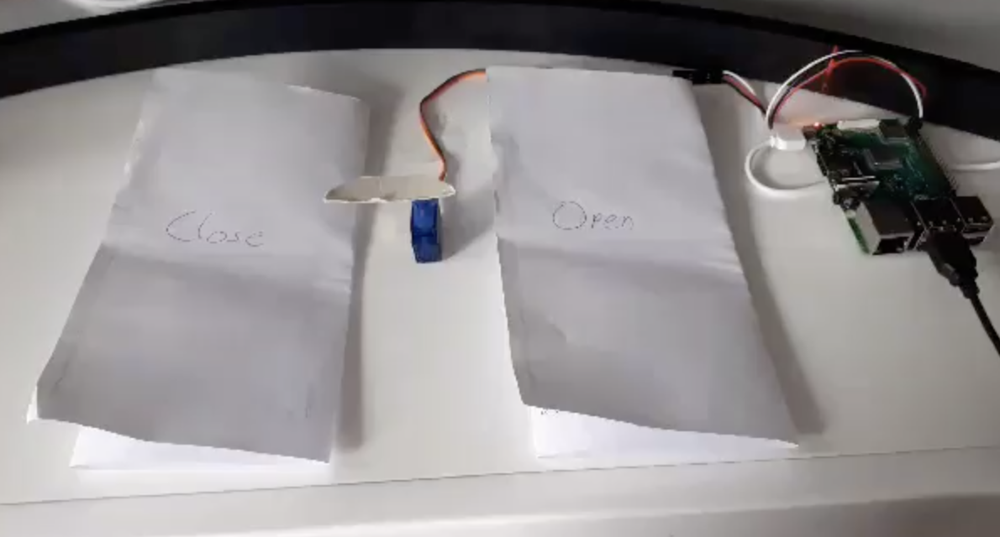

Two, a QR code that is paired to that smart lock.

This QR code allows the user to identify their lock for pairing, without manually entering a long key.

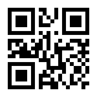

Three, one or more NDEF tags.

The NFC tags will be how the user interacts with the lock, we could have them come pre written, but want to give our users more flexibility in how they set up their locks.

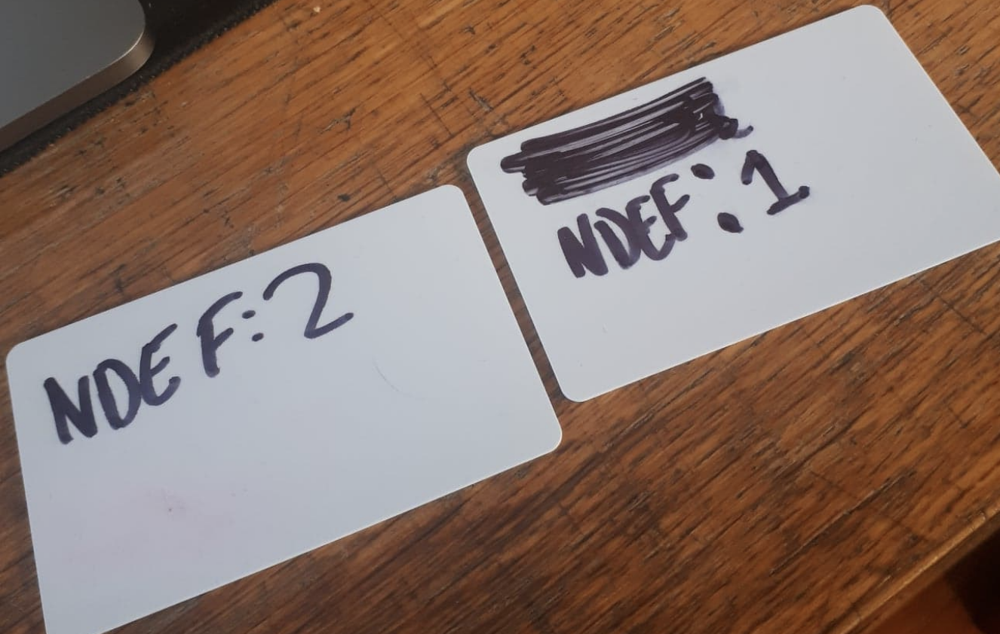

Four, the SafeHouse app. The app is currently only for android, due to the strict NFC limitations on iPhones, although this is slowly changing and the app could make it to IOS in the future.

#### 3. Starting

The users start by downloading the safehouse app onto their devices. The app will appear like this on the users device.

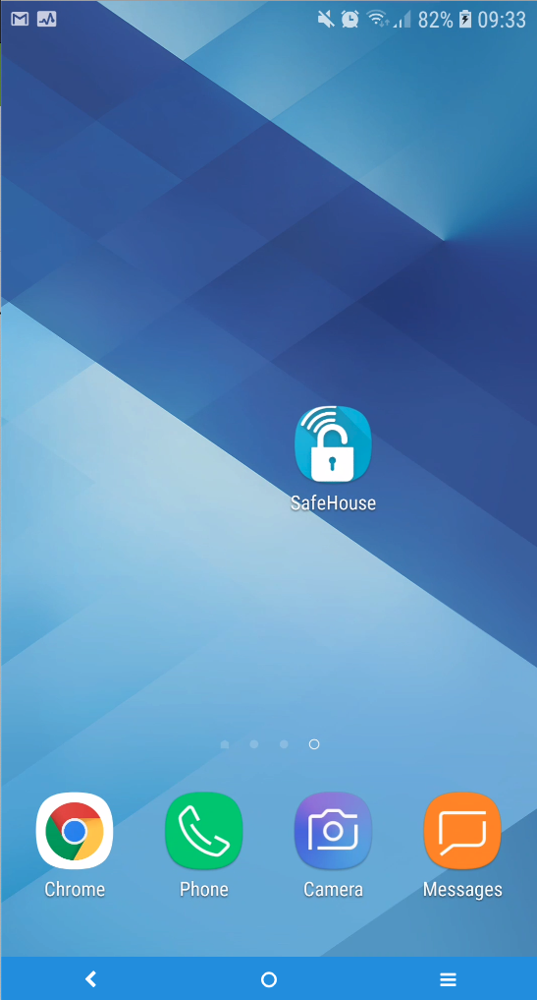

The app will guide the user, with on screen instructions, through the setup process.

The user begins by pressing ‘Start’ on the splash screen

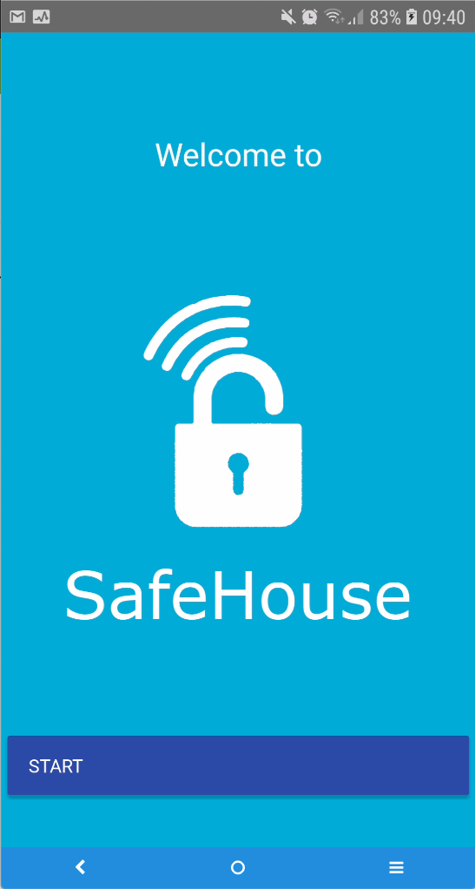

#### 4. Set Up

As this is the user's first time using the app, we are brought to the setup screen, where the user will press ‘Begin Set Up’ to move on.

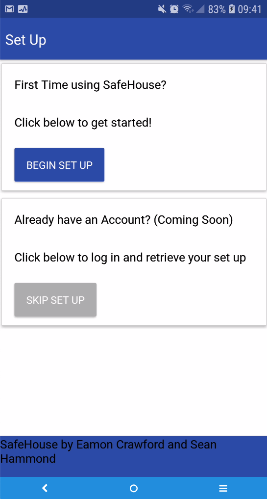

#### 5. Biometrics

SafeHouse uses the device's native biometric capabilities for authentication. On this screen the user is informed that their device doesn’t currently support fingerprint scanning. The user is asked if they could go to their device's settings and turn on fingerprint, if their device supports it.

Unfortunately for users who’s devices don't support biometric authentication, our pin fall back feature is not ready at this time in development.

Lets enable fingerprint authentication on the device.

After reloading the app, the app informs us that our device now supports fingerprint scanning.

The app then asks the user for their email address. This field will only accept valid email addresses. After entering a valid email address, the submit button will stop being disabled.

After the user enters a valid email address and presses submit, they will be taken to the next screen.

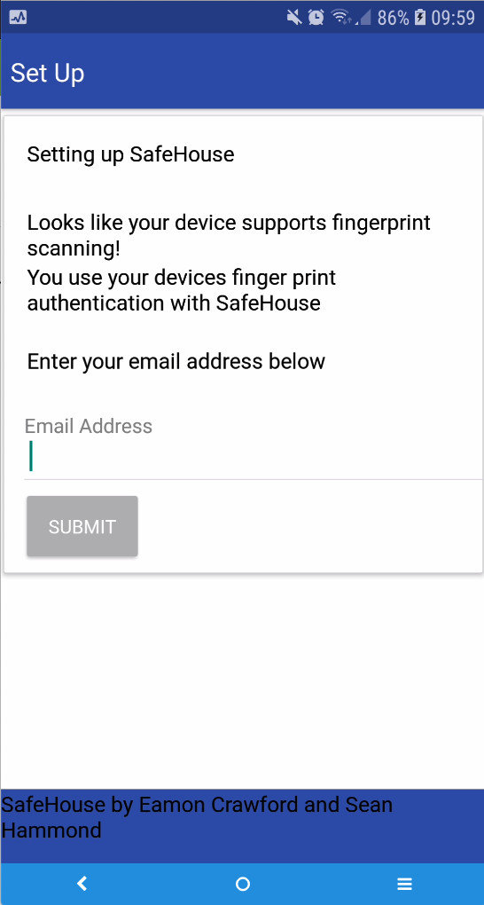

#### 6. QR Scan

On this screen the user will begin to set up their lock. The first option given to the user is to scan the QR code that came with lock. However there is also the option to just skip past here, straight to the home screen. The user can still add locks at a later time, but this is for the situation where a lock has already been set up by another user and we are just going to add this user to that lock.

The user will press scan to continue setting up, this will open the device's camera.

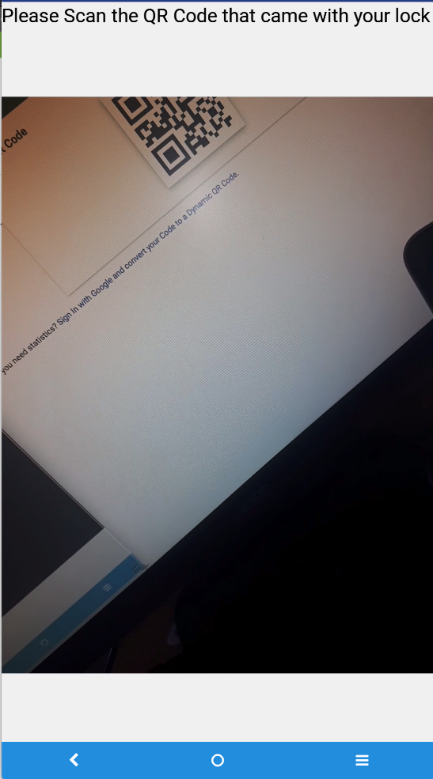

The user then scans the Qr code that comes with their lock. After scanning the user will be asked to Sign in with their finger print.

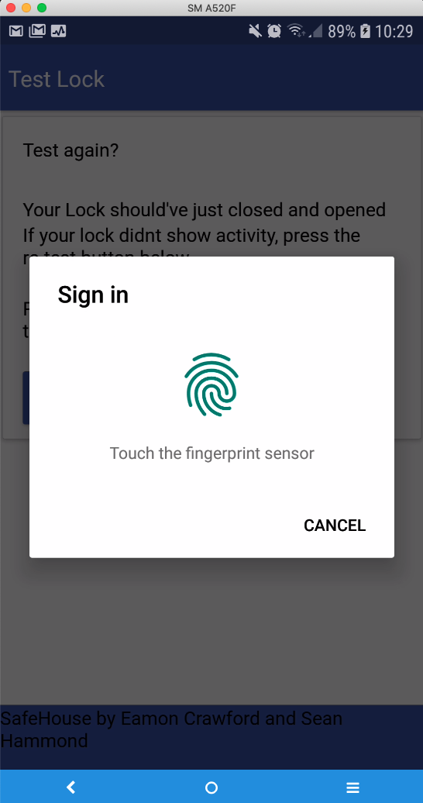

#### 7. Test

After successfully signing in, the smart lock will close and open, this is to confirm everything is working as expected for the user.

If not, the user can re test and re scan the QR code on this screen before continuing.

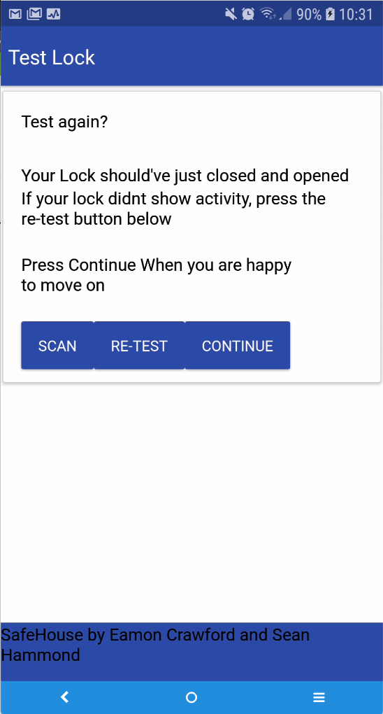

#### 8. Name Lock

On the Name Lock screen, the user will be asked to name their lock. This makes it easier for the user to identify their smart locks.

After entering a valid name, the user can then write the lock link to their NFC card.

If the write is successful, the user will be given feedback indicating so and will move to the next screen

#### 9. Test NFC

Test NFC is another testing screen, to make sure the device can read from the newly set up NFC card. If the user can scan their NFC card successfully we will move on.

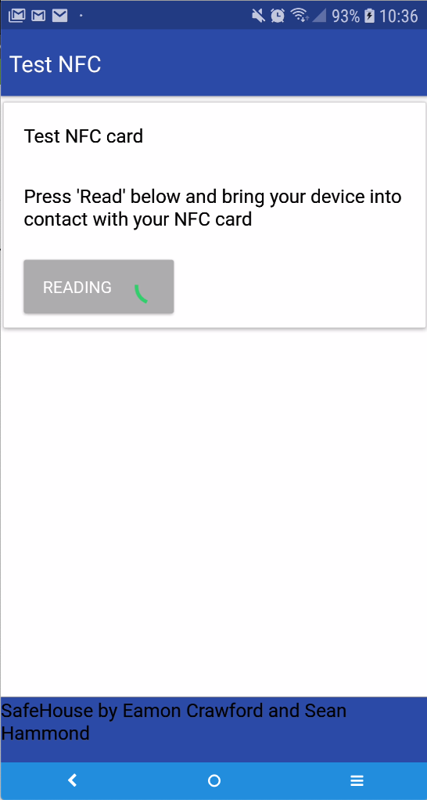

#### 10. Finish

This is the last screen of the lock setup, the user will be warned that finishing will lock their smart lock, and should only continue if they are happy everything is functional.

After hitting finish the user is given another chance to confirm their decision. After that the user must authenticate to enable their lock. This will finish the lock set up.

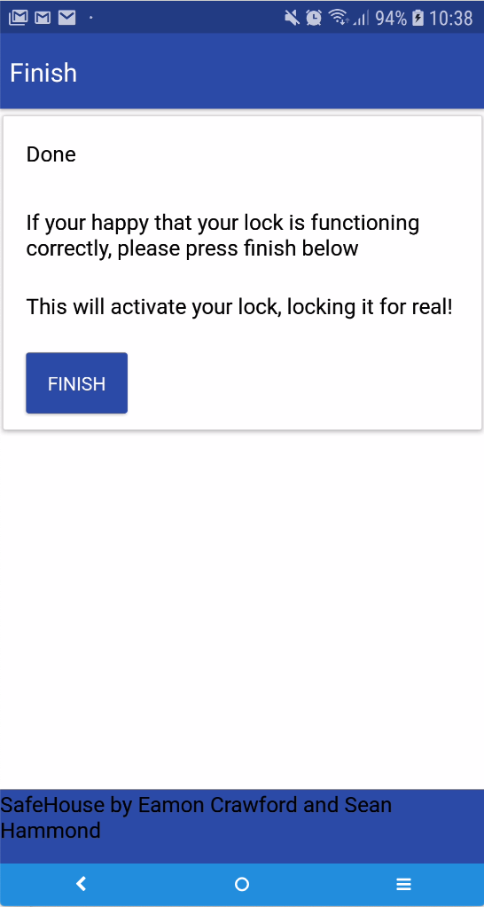

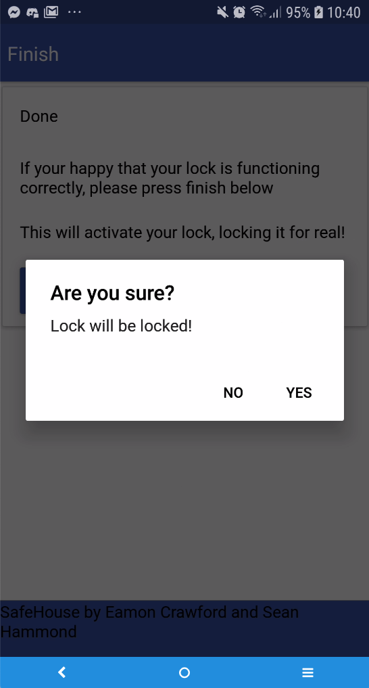

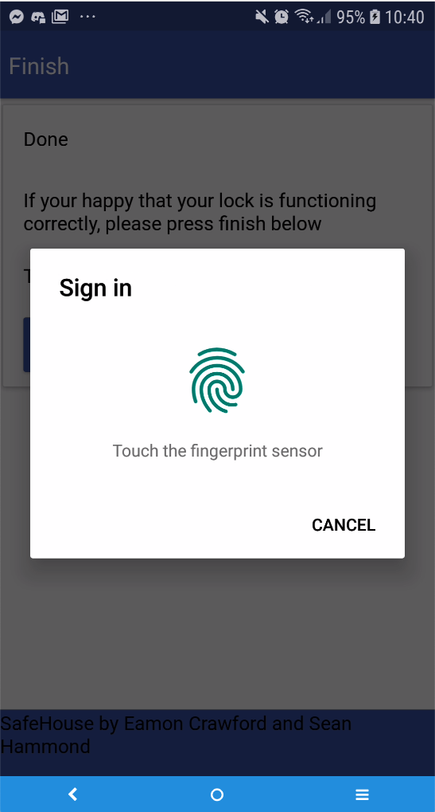

#### 11.Home

Now the user is on the SafeHouse HomeScreen. Here the app will automatically scan for NFC tags to read, so when the user opens the app they don’t have to click again, although we can cancel the scan. Reading a tag here will let us open the lock associated with it if we authenticate with our fingerprint and we have access to that particular lock.

The user can navigate between screens using the tabs at the bottom, here we can go to the settings page, and the share access page.

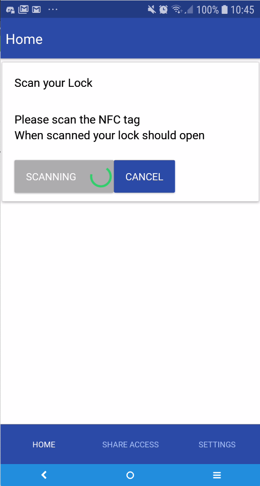

#### 12. Share Access

In the Share Access tab, we can give other users access to our locks by entering their email address, pressing scan,reading the tag of the lock we want to share, and authenticating ourselves. A user who has had a lock shared with them can open that lock with their own credentials from their own device.

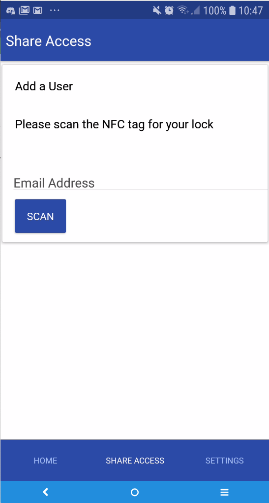

#### 13. Settings

Here in the settings we are able to add more locks to our account, following the same set up flow from before. We can also wipe our account, deleting all data associated with it.

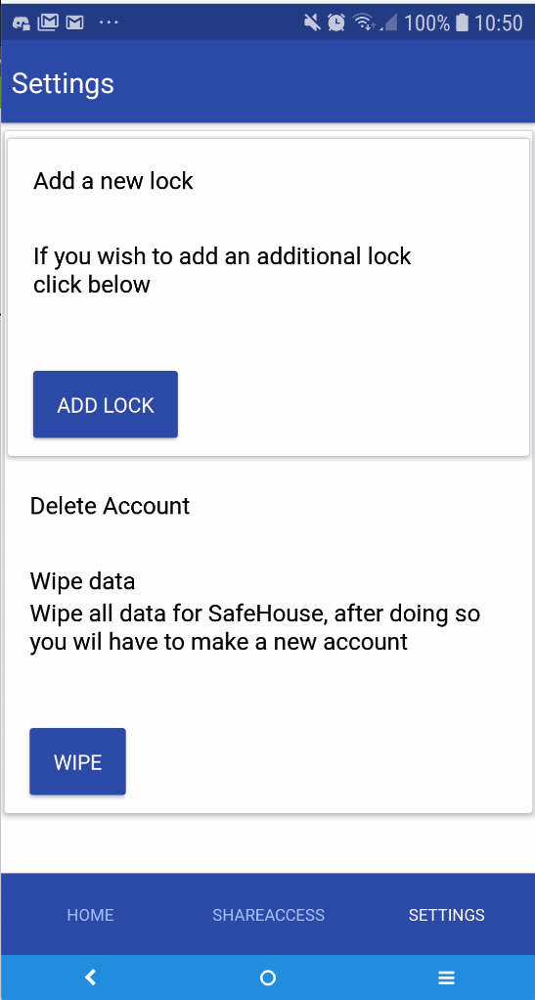

#### Thank You

Thank You for reading through this user’s guide.